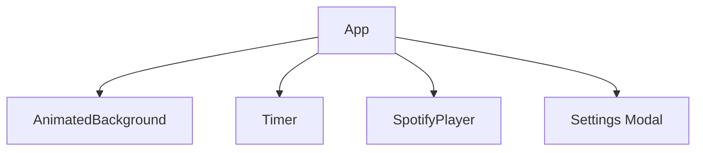
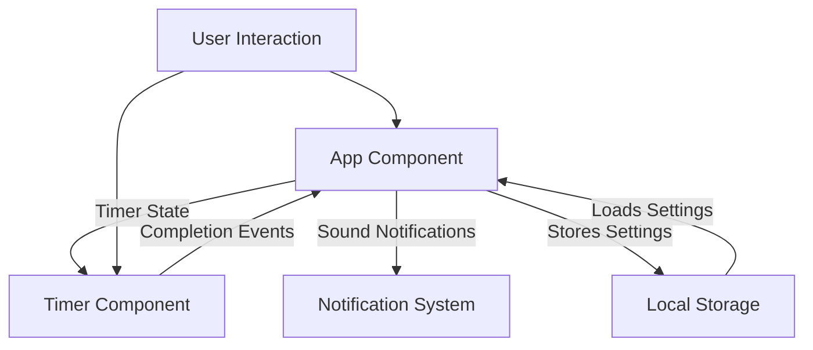
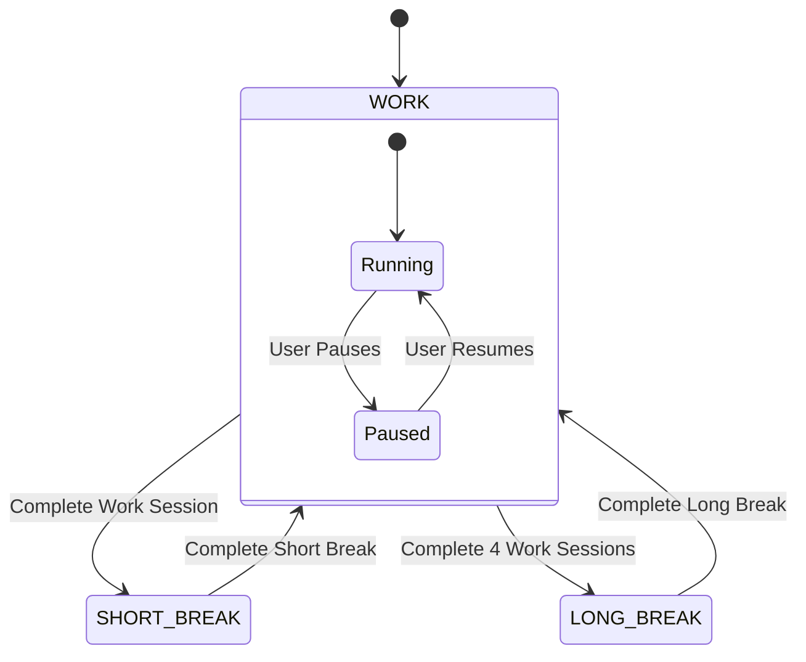
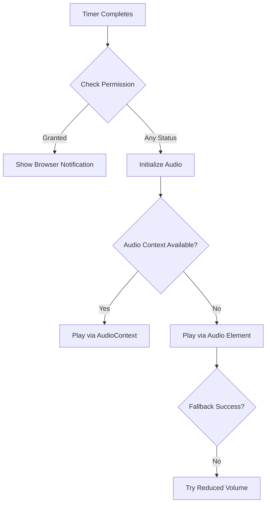

# Pomotomato - Pomodoro Timer Application

## Overview

Pomotomato is a modern, responsive Pomodoro timer web application built with React and TypeScript. It features a beautiful animated background, customizable timer settings, notification support, and a responsive design that works on both desktop and mobile devices.

## Core Features

- 🍅 Customizable work, short break, and long break durations
- 🔔 Browser notifications and sound alerts when timers complete
- 🔄 Automatic transition between work and break sessions
- 📱 Responsive design for all device sizes
- 🎨 Beautiful animated background with blob animations
- 🎵 (Placeholder) Spotify integration for focus music

## Project Structure

```
/pomotomato/
├── src/
│   ├── components/         # React components
│   │   ├── AnimatedBackground.tsx
│   │   ├── SpotifyPlayer.tsx
│   │   └── Timer.tsx
│   ├── utils/             # Utility functions
│   │   ├── notifications.ts
│   │   └── storage.ts
│   ├── styles/            # CSS styles
│   │   └── AnimatedBackground.css
│   ├── App.css            # Main application styles
│   ├── App.tsx            # Main application component
│   ├── timerTypes.ts      # TypeScript definitions for timer modes
│   └── index.tsx          # Application entry point
├── public/                # Static assets
│   ├── notification.mp3   # Notification sound
│   ├── favicon.ico
│   └── index.html
└── package.json           # Dependencies and scripts
```

## Architecture

Pomotomato follows a component-based architecture with the main App component managing the overall state and child components handling specific functionality.

### Component Hierarchy



### Data Flow



### State Management

The application uses React's useState and useEffect hooks for state management:



## Core Components

### App.tsx

The main container component that manages:
- Overall timer state and mode tracking
- Timer settings and persistence
- Mode transitions and pomodoro sequence
- Notification handling
- Document title updates

### Timer.tsx

Handles the actual timer functionality:
- Countdown logic with setInterval
- Timer display formatting
- Play/pause and reset functionality
- Mode switching interface (Focus, Short Break, Long Break)

### AnimatedBackground.tsx

Creates the visually appealing background:
- Canvas-based animated blobs
- WebGL rendering for smooth animations
- Responsive sizing based on window dimensions

## Key Systems

### Notification System

The notification system (utils/notifications.ts) provides:

1. **Browser Notifications**: Visual system notifications when timers complete
2. **Sound Alerts**: Audio notifications with fallback mechanisms
3. **Permission Handling**: Requesting and checking notification permissions
4. **Audio Context**: Modern Web Audio API implementation with fallbacks



### Storage System

The storage system (utils/storage.ts) manages:
- Saving and loading user preferences
- Default timer settings
- Local storage interaction

## Implementation Details

### Responsive Design

The application is fully responsive with:
- Media queries for different device sizes
- Flexible layouts using CSS flexbox and grid
- Mobile-friendly controls and interfaces
- Touch-optimized interaction

### Auto-start Feature

The timer can automatically start the next session:
- After a work session completes, can auto-start break
- After a break completes, can auto-start work session
- Configurable through settings

### Notification Handling

Special considerations for notifications:
- Debouncing to prevent duplicate notifications
- Visibility state handling to manage background tabs
- Initialization of audio on user interaction (browser requirement)
- Multiple fallback mechanisms for sound playback

## Browser Compatibility

The application works across modern browsers with special handling for:
- Audio autoplay restrictions in Chrome, Safari, and Firefox
- Notification permission variations
- Mobile browser quirks (especially iOS)

## Future Enhancements

Potential areas for future development:
1. **Task Tracking**: Add ability to associate tasks with pomodoro sessions
2. **Statistics**: Track and visualize productivity metrics
3. **Full Spotify Integration**: Complete the Spotify API integration
4. **Offline Support**: Add Progressive Web App capabilities
5. **Theme Customization**: Allow users to select different themes and animations

## Development Workflow

1. **Running locally**: `npm start`
2. **Building for production**: `npm run build`
3. **Testing**: `npm test`

## Known Issues

1. **Notification Sound Issues**: Some browsers require explicit user interaction before playing sounds
2. **Mobile Browsers**: iOS Safari may require multiple interactions to enable audio
3. **Background Tabs**: Browsers may throttle timers in background tabs, affecting accuracy

## Using Pomotomato

1. Set your desired work and break durations in settings
2. Click "Start" to begin the pomodoro session
3. When the timer completes, a notification will alert you
4. Take your break, then continue with the next work session
5. After 4 work sessions, a longer break is suggested 