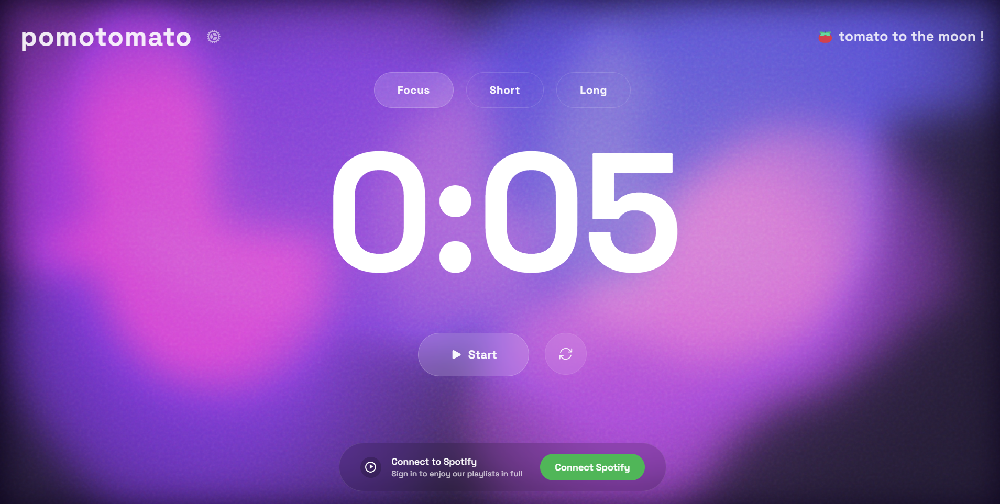

# Pomotomato 🍅

A modern, beautiful Pomodoro timer app with a vibrant animated background and Spotify integration.



## Features

- **Beautiful Design**: Colorful animated background with gradient blobs that morph and move
- **Three Timer Modes**: Focus, Short Break, and Long Break
- **Customizable Settings**: Adjust work and break durations to fit your workflow
- **Notifications**: Audio and browser notifications when timers complete
- **Auto-Break Mode**: Automatically transition from work to break and vice versa
- **Responsive Design**: Works on desktop and mobile devices
- **Spotify Integration**: Connect to Spotify to play your favorite productivity playlists

## Getting Started

### Prerequisites

- Node.js (v14+)
- npm or yarn
- Modern browser with notifications support
- Spotify Developer account (for Spotify integration)

### Installation

1. Clone the repository:
```bash
git clone https://github.com/yourusername/pomotomato.git
cd pomotomato
```

2. Install dependencies:
```bash
npm install
```

3. Set up environment variables for Spotify integration:
```bash
# Copy the example env file
cp .env.example .env

# Edit .env file with your Spotify Client ID
# Get your Client ID at https://developer.spotify.com/dashboard/
```

4. Start the development server:
```bash
npm run dev
```

5. Build for production:
```bash
npm run build
```

### Spotify Integration Setup

To set up Spotify integration securely:

1. **Create a Spotify Developer App:**
   - Go to [Spotify Developer Dashboard](https://developer.spotify.com/dashboard/)
   - Create a new app
   - Set these Redirect URIs in your Spotify app settings:
     - For local development: `http://localhost:5173` (or your Vite dev server port)
     - For GitHub Pages: `https://[your-username].github.io/pomotomato/`

2. **Set up your Client ID (Interactive):**
   ```bash
   npm run setup
   ```
   This script will prompt you to enter your Spotify Client ID and securely save it to the necessary files.

3. **⚠️ Security Best Practices:**
   - Never commit any file containing your Spotify Client ID
   - Make sure `public/env.js` is in your `.gitignore`
   - For production deployments, always use environment secrets
   
4. **For GitHub Pages deployment:**
   - Add your Spotify Client ID as a secret in your GitHub repository:
     - Repository → Settings → Secrets → Actions
     - Add new secret with name `SPOTIFY_CLIENT_ID`
   - The GitHub workflow will securely inject the Client ID during build

5. **Troubleshooting:**
   - If you get "Missing required parameter; client_id" error:
     - Run `npm run setup` to enter your Client ID securely
     - Make sure your redirect URI in Spotify Dashboard exactly matches your app's URL
     - Check browser console for any loading errors

## Usage

1. Select your desired mode (Focus, Short Break, or Long Break)
2. Press the Start button to begin the timer
3. Use the Reset button to restart the current timer
4. Access settings by clicking the gear icon in the top right
5. Connect to Spotify using the integration at the bottom of the screen
6. Allow browser notifications when prompted for alerts when timers complete

## Technologies Used

- React
- TypeScript
- Vite
- Heroicons
- Browser Notifications API

## Customization

Customize timer durations in the settings panel:
- Work/Focus duration
- Short break duration
- Long break duration
- Auto-start breaks
- Enable/disable notifications

## Deploying to GitHub Pages

To deploy Pomotomato to GitHub Pages:

1. **Fork or clone the repository to your GitHub account**

2. **Set up GitHub Secret**:
   - Go to your GitHub repository
   - Click on "Settings" > "Secrets and variables" > "Actions"
   - Click "New repository secret"
   - Name: `SPOTIFY_CLIENT_ID`
   - Value: Your Spotify client ID from the Spotify Developer Dashboard
   - Click "Add secret"

3. **Enable GitHub Pages**:
   - Go to your repository's "Settings" > "Pages"
   - Select "GitHub Actions" under "Build and deployment"

4. **Push to main branch** to trigger the deployment workflow

5. **Update Spotify Redirect URI**:
   - Go to your [Spotify Developer Dashboard](https://developer.spotify.com/dashboard)
   - Select your application
   - Click "Edit Settings"
   - Add your GitHub Pages URL to the Redirect URIs:
     `https://[your-username].github.io/pomotomato/`
   - Click "Save"

After deployment, your app will be available at `https://[your-username].github.io/pomotomato/`

## License

This project is licensed under the MIT License - see the LICENSE file for details.

## Acknowledgments

- Inspired by the Pomodoro Technique by Francesco Cirillo
- Animated background inspired by modern design trends
